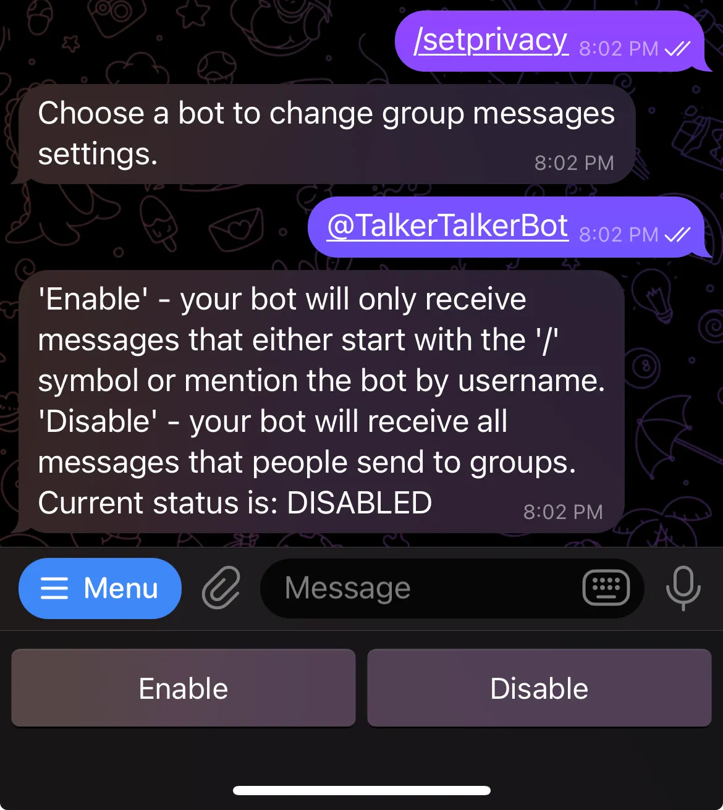
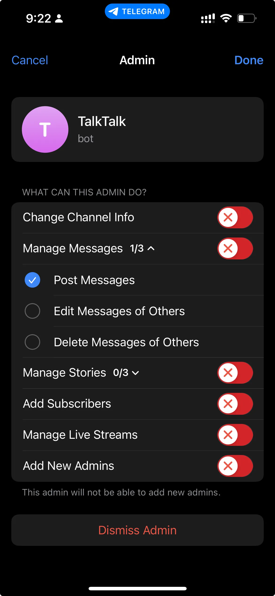
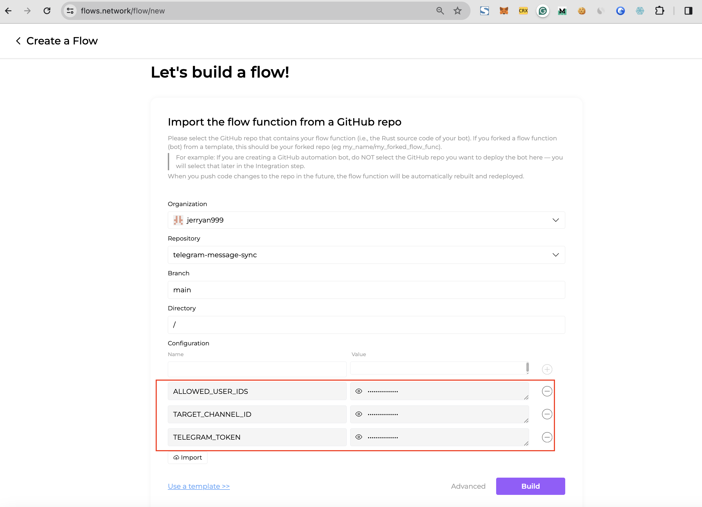
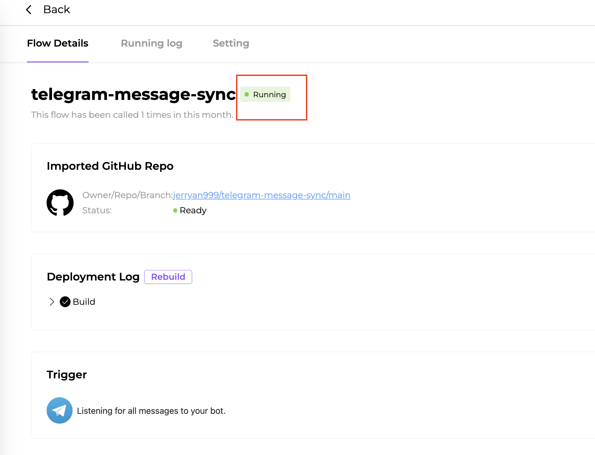

# 
A Telegram Message Sync bot

Deploy this function on [flows.network](https://flows.network), and you will get a Telegram bot that sync messages from Telegram groups to a channel automatically.

## Pre-requisites
1. Bot token <TELEGRAM_TOKEN>
* You need a bot token to access the Telegram API.[Just click here](https://blog.devgenius.io/how-to-set-up-your-telegram-bot-using-botfather-fd1896d68c02)
* Disable privacy mode for your bot by sending the command `/setprivacy` to the botfather.

* add the bot to the group from which you want to forward messages.
* add the bot to the channel and give it admin’s post messages permission.

2. Telegram user identifier. <ALLOWED_USER_IDS>  
You can get the user id by sending a message to the bot `@userinfobot` and the bot will reply with your user id.

3. Get your channel identifer <TARGET_CHANNEL_ID> [Just click here](https://neliosoftware.com/content/help/how-do-i-get-the-channel-id-in-telegram/)

## Deploy your Bot

### 1 Clone this repository to your github account

### 2 Create a bot 

[**Just click here**](https://flows.network/flow/new)

Here you can see three variables. You should fill them with the prerequisites mentioned above

Click on the **Build** button.

## Give it a try. 

As soon as the flow function's status becomes `ready` and the flow's status becomes `running`, the Telegram Telegram bot goes live. Go ahead and send a message to the group!

